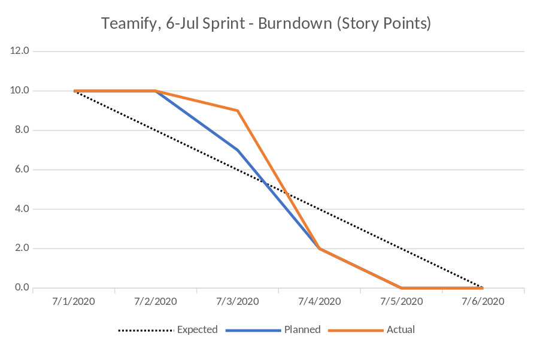
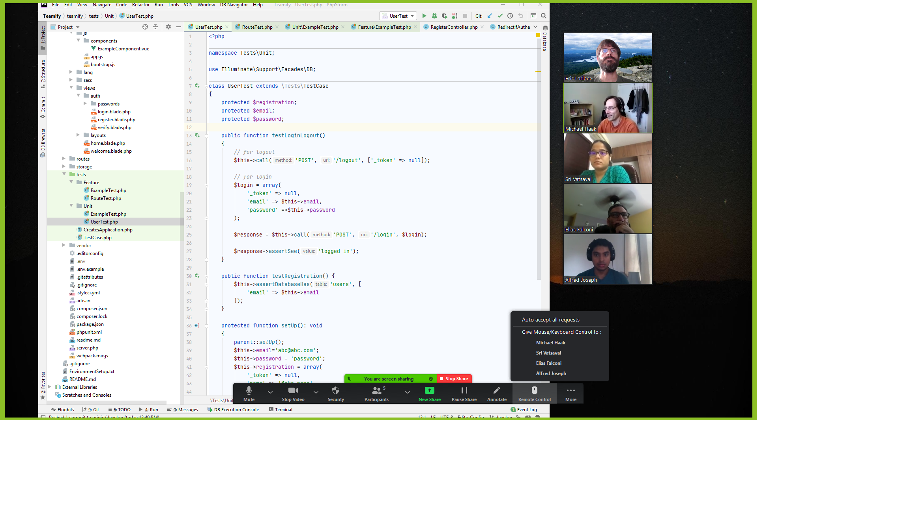
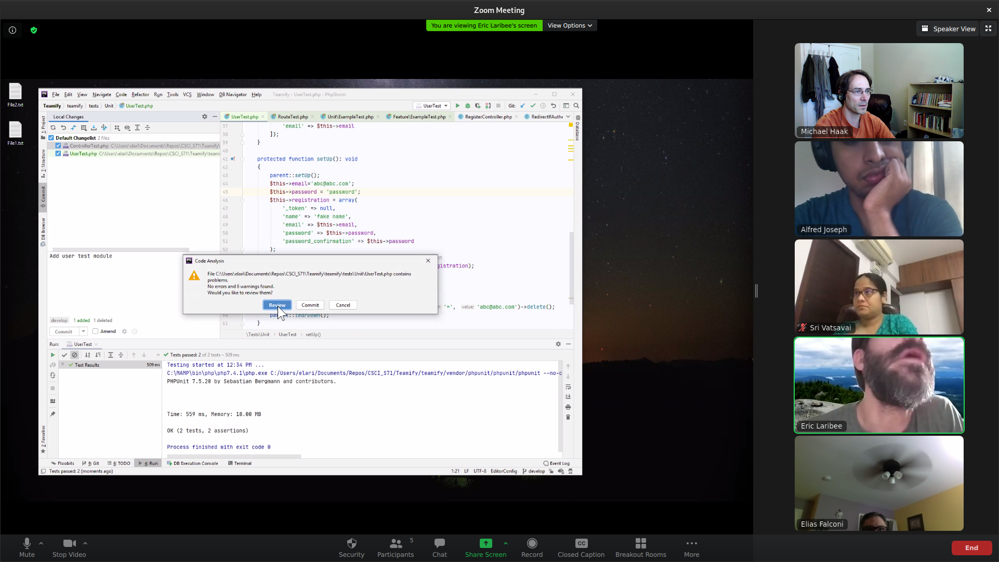
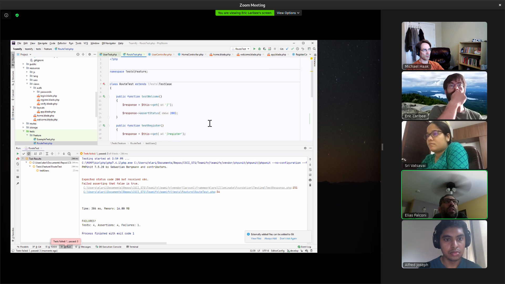

# Teamify   
A tool for students to self-organize into effective agile teams

**Team Name:** Teamifysummer2020


**Roster:**  
Product owner/Developer:  Sri Vatsavai   
Scrum master/Developer:  Eric Laribee   
Developer:  Alfred Joseph   
Developer:  Michael Haak   
Developer:  Elias Falconi   

**Product Name:** Teamify

**Far Vision:** Facilitating the creation of the right team at the right time

**Near Vision:** A tool for students to self-organize into effective agile teams

Today, when course instructors\
Want to allow students to form their own teams\
They have to let students figure out the team-formation process as well as their teams\
This is unacceptable, because ad hoc processes are opaque, slow, and may result in unbalanced teams, resulting in student anxiety and suboptimal team products\
We envision a world where team building is balanced, easy, fast, and transparent\
We’re bringing this world about through an online app to manage the team formation process.

**Stakeholder Types:**  
Agile course students  
Agile course instructors  
Developer in an Agile organization\
Line manager in an Agile organization

**User Persona for Richard Kasperowski (real person):**  
Name:  Richard  
Role:  Agile Course Instructor  
Age:  50  
Gender: Male  
Skill level 1:  Professional Agile trainer, coach, and course Instructor  
Skill level 2:  Professional Agile software development team facilitator  
Skill level 3:  Author of Agile topics  
Motivation:  Provide students a welcoming, unintimidating and easy-to-use means to share details about themselves and self-organize into teams that I can reference as a single source for student and team information.  
Frustrations:  Using Slack as a team formation tool is not user friendly for both Instructors and students.  Students come to me with questions where answers could be provided upfront in the course.  Also, it's difficult to discover who has _not_ been active or able to find a team.  
Desires/wants/needs: Make it super-easy for students to form teams for group projects. Make sure no students are left behind. Also wants to encourage diversity of skills within each team.

**User Personae for Students (fictional):**  
Name: Julia  
Role: Student  
Age: 23  
Gender: Female  
Skill level 1: Experienced in using Slack  
Skill level 2: Experienced in programming languages (Java, Python)  
Skill level 3:  
Motivation: To get on a team with others who have complementary skills.  
Frustrations: Doesn’t know what skills will actually be needed, and doesn’t know who has them. Is intimidated by the process of meeting new people in the class and wants the process to be standardized and easy.   
Desires/wants/needs: Some team project suggestions with the skills required.  A way to see who has skills that complement hers so she can form a team with them to have a successful project.  A way of knowing what teams are forming and looking for new members.

Name: Lindy\
Role: Student\
Age: 36\
Gender: Male\
Motivation: To get a team fast, so he can start working on the assignment quickly.\
Frustrations: Doesn’t know anyone else in the class.  Doesn’t know who is already on a team, or who is actively looking.\
Desires/wants/needs: A quick way to tell who to get in touch with to form a team and the best way to get in touch with them.

Name: Emmet Otter\
Motivation: To learn as much as possible\
Frustrations: Doesn’t know who has talent or skills or experience in the things she wants to learn about.\
Desires/wants/needs: A match-maker to pair her with someone else who wants to learn her skills and who wants to teach her the skills she’s trying to learn.

**Product Backlog:** https://trello.com/b/i3THeXFj/teamify2020  

**Backlog ordering rationale:**

The backlog is composed of items suggested by two types of stakeholders: 1) the Instructor, and 2) the students (CSCI S-71 2020).  The real students in this case were the members of the Scrum team, and the instructor was the real instructor of Harvard's CSCI S-71 course.  We opted to weigh the instructor's priorities more than the students' due to his experience of watching teams form many times (each time he has offered the course) as well as to temper our own biases in our dual roles as developers and students.

The instructor's top PBI goals seemed to focus on ensuring no student was left behind without a team and no understandable way to join a team.  On the other hand, our top PBI goals were focused on making the team formation process more transparent and removing barriers to the communication of skills and experiences so that diverse teams could form.  In the end, to balance the needs of both personas, we interleaved these top priorities, starting with the instructor's, while trying to maintain a product backlog order in which lower priority backlog items only depended upon higher priority backlog items.

The minimum viable requirements for the product were captured without early focus on implementation details.  We expect that during sprint planning, each of the Product Backlog Items will be expanded into multiple work items as the backlog is groomed, we consider more specific implementation details, and we learn more about our product together with our stakeholders.

**Definition of Done:**      
- All acceptance criteria are resolved  
- Work has been peer reviewed and all issues addressed  
- Work is commited to repository   
- Work has been independently tested from the repository and is bug free   
- PO has accepted the story     

**Definition of Ready:**      
- PBI has a user story Title   
- PBI has a user story Description (opening sentence)   
- Any conjunctions in description have been examined for further refinement   
- The INVEST mnemonic has been considered for the PBI   
- At least one Acceptance Criteria is defined   
- Additional details are captured (implementation requirements and/or options)  
- PBI is estimated in story points relative to other PBI's   
- PBI is centrally stored in Trello board with other PBI's   
- PBI has been priortized by the PO  
- Development team has accepted the PBI

**Estimating activity:**  Affinity estimating  

All members of our team, including the Scrum Master and Product Owner, are also doubling as development team members.  Therefore all members of the team participated in our affinity estimating activity.

We followed the procedure outlined in the article [Affinity Estimating: A How-To](http://www.gettingagile.com/2008/07/04/affinity-estimating-a-how-to/) by Chris Sterling.  First, all PBIs were placed as stickies on a [Miro board](https://miro.com/app/board/o9J_kqfm64Y=/).  Each team member took one color of sticky note, and we ordered them silently from left to right, smallest to largest.  After that, we had a group discussion in which we collaboratively adjusted items, talking through each PBI where some team member found it in an unexpected order.  Finally, we identified natural groupings.  In two instances where a PBI fell between two groupings, we opted to include the PBI in the larger grouping, since we may not be able to deliver that item in the same amount of effort as PBIs in the smaller grouping.  We assigned each grouping a story point value from the Fibonacci sequence and updated our product backlog accordingly (putting the point value in parentheses before each PBI title in Trello).

As we get more experience with our chosen tech stack and as a team, we expect that our estimates will get better, so we consider these estimates provisional.  They will be updated during sprint planning or backlog grooming as necessary.   

-----------------------------------------------------------------------------   
## First Sprint  

**Sprint Goal:**  Display resgistered students and team names.  

**Forecast:**  We forecasted 10 points for our velocity in this Sprint.  This was based on the point scale that was developed in our estimation activity and upon inspection of the Tasks and Acceptance Criteria for the PBIs at the top of the backlog.  Given that we do not have historical performance data, we pulled items off the Product Backlog into the Sprint Backlog, stopping at a point where the amount of work in the Sprint Backlog was reasonable to expect to complete per our Definition of Done.  Without collective experience yet, we had to rely on our past individual experiences to guess about what was reasonable and then come to concensus.

**Sprint Planning:**

As stated above, during Sprint planning we decomposed the PBIs at the top into Tasks to develop a shared understanding of the work required to complete them.  PBI's with higher point values were split into smaller point valued PBIs (User Stories) where appropriate.  All stories in the the Sprint Backlog have size of less than half of the forecast velocity.  After story splitting, the specific stories that we pulled from the top of the product backlog into the sprint backlog for this sprint were:

| Points | Story                                              |
|--------|----------------------------------------------------|
|   1    | A student can create an account in the app         |
|   2    | Display of all student names                       |
|   3    | Display current team count and team members' names |
|   2    | Display students not on a team                     |
|   2    | Instructor account                                 |

**Product Backlog and Kanban Board:**  URL:  https://trello.com/b/i3THeXFj/teamify2020   
All PBIs and Tasks are aggregated on a single board in Trello.  Initial PBIs have a yellow label and are not yet decomposed into Tasks.  PBIs that were placed in the Sprint Backlog have a green label and have been decomposed into Tasks.  Tasks have an orange label.  As Sprint Backlog items and Tasks have been put In Progress or have been Completed, they have been moved across the Kanban board into the corresponding columns.   

**Additional material for this assignment:**  A single directory 'admin' in our git repository contains multiple supporting files for this assignment, explained below:  https://github.com/josephalfred7/Teamify/tree/master/admin   

**Sprint Burndown Chart:**

Original File: https://github.com/josephalfred7/Teamify/blob/master/admin/6-JulSprintBurndown.xlsx   



We forecasted 10 points for the sprint.  Our chart has several lines.  First, the orange line indicates our actual progress.  We compared that with two other lines.  The dashed line shows what progress would have to be made if we completed the same number of points each day.  On the other hand, the blue shows our expected progress from the plan our team made during Sprint Planning.

We anticipated that getting started with our first story would take some time as we set up our development environments, got used to mob programming, familiarized ourselves with the web and unit test frameworks we had chosen.  You can see that in gentle slope of the blue line at the start of the sprint.  After that, we reasoned, we could move faster.  Thus the blue line is steeper toward the middle of the sprint.

Our actual progress, the orange line, shows that our plan was fairly reasonable.  There was one day (7/3) where we did not finish the story we had planned to, but we were very close.  We marked those points completed on the next day as we caught up with our plan.

Because our actual progress matched our planned progress well most of the time, we didn't have to adapt much.  But because we were able to inspect our planned progress  on a visible burndown chart, we were able to end the day on 7/3 feeling confident that our slight delay in finishing one story would not cause us to miss our sprint goal.

**Daily Scrum Log:**

A Daily Scrum event has been held since 06-28-20.  A daily log of the scrum has been recorded for each of these events documented in separate files titled ``DailyScrum_<date>``, and located at: https://github.com/josephalfred7/Teamify/tree/master/admin

Each of these files is formatted to include three lists with the headings

* What we did in the past 24 hours?
* What are we going to do in the next 24 hours?
* What are the impedements?

When impediments have been identified, a plan was also defined to take action to remove them.

Note that in our daily Scrum logs, when referring to "we," that means all members of the team working together as a mob.

Here's a sample from 7/5/20:

	What we did in the past 24 hours?
	---------------------------------
	
	- We continued mob programming with TDD and finished the Sprint backlog (Instructor account).   
	- We reviewed the rubric tracker to ensure we have completed the assignment.   
	- Eric reviewed the Sprint Burndown chart with our progress.  
	- Elias uploaded our application to the server for our Sprint Review.  
	- Michael uploaded images of our mob programming sessions and TDD evidence.   
	- We updated our Kanban board with our progress to date.  

	What are we going to do in the next 24 hours?
	---------------------------------------------
	
	- Michael will create a suggested agenda for the Sprint Review meeting.   
	- Alfred will confirm that he can demo the app from the server.  
	- We will meet before (noon) the Sprint Review (1 PM) to discuss the agenda.   
	- Eric will update the Sprint Burndown chart with our progress.  
	- Michael will review/edit the new sections added to the README.  
	- Eric will create an initial writeup for the Project 2 of 3 submission.  
	- Each of us will complete our individual assignments due on Monday.  

	What are the impedements?
	-------------------------

	- There is a misinterpretation between project expectations for the Backlog/Kanban boards.  
		- We will receive guidance from Richard on Kanban board layout at our Monday mtg.  
	- We sometimes have very laggy performance mob programming through Zoom.   
		- We will work to identify the host that provides the Team with the best performance.   

**Mob Programming:**

All development for this sprint was conducted in mob programming sessions with the entire team.

We tried using Floobits at first, but quickly found that for more than 2-3 people, it sometimes overwrote important files at random.  We switched to giving remote control via Zoom after that.

We did perceive benefits to code quality through mob programming.  But in addition, since we started out with only one person having experience with our web framework and no one having experience with our unit testing framework, we found mob programming indispensable for making sure we were all growing our technical skills together.

Here we are passing the control to a new driver:



And here we are committing the code we just finished writing:



**Test Driven Development:**   All development for this sprint was conducted using Test Driven Development, creating tests following the Tasks of the Kanban board that initially failed and then were made to pass by implementing simple solutions.  In all, we created 21 tests with 51 assertions.  They all passed at the end of the sprint.

For example, when adding a page to our product that should list students in alphabetical order, we created tests in the following order, making each pass before writing the next failing test:

1. The target web page exists
1. The target web page is titled "Student List"
1. The name of a student, once registered, appears on the page
1. The list of student names fed to the page is in alphabetical order

Here we are just after having created a failing test:



Here we're celebrating after finally passing a particularly tricky test that we previously wrote.  Can't you tell we're celebrating?


**Sprint Review:**

We conducted a Sprint Review on Monday, July 6, 2020.

At that sprint review, we demonstrated our working software to our actual stakeholders, Richard Kasperowski and Anupam Preet Kaur.  Here they are, looking at our working web site:


In general they were happy with the product so far.  Their primary concern is getting students onto teams.  So we'll keep the idea of assigning students to random groups as the highest priority product backlog item.

------------------------------------------------------------------------

## Final Sprint

### Forecast


### Sprint backlog


### Burndown chart


### Daily Scrums


### Mob programming


### Test-first development

As in the first sprint, we are building our product test-first.  For example, one of our solutions to a story this sprint was creating a button to add a new team.  The first acceptance criteria was that a user could indicate that they wanted a new team.  Accordingly, our first step in implementing the solution was to write a test asserting that the "Add team" button existed.  Since we hadn't implemented anything yet, it failed, and we proceeded to add the button to make it pass.

We engaged in BDD to develop some of our tests.  For instance, a solution to another story was to add a button to distribute students randomly among existing teams (which we called "shuffling").  We did the Discovery phase during Sprint Planning, where team members asked questions and the whole team achieved shared understanding using a few examples.  One example we landed on was that if a student was not on a team before shuffling was initiated, they should be on a team after shuffling.  In other words, the product should not just shuffle students who are already on teams.  We did not use Cucumber for this project, but the formulation of this rule in Gherkin would be:
```
Feature: Shuffle students

Rule: Shuffling leaves all students on teams

  Scenario: Students without a team
    Given Anita has registered
      And Anita is not assigned to a team
     When an instructor shuffles teams
     Then all students are on teams
```
We then automated this using a test in our PHPUnit test suite.  The test registers a new student without a team, registers an instructor, has the instructor press the "shuffle" button, and then asserts that all students are assigned to a team.

At the end of the last sprint, we had 21 tests.  This sprint, we wrote ??? more test for a total of ??? tests.  By the end of the sprint, all our tests were passing.

### Continuous integration and deployment


### Sprint Review
